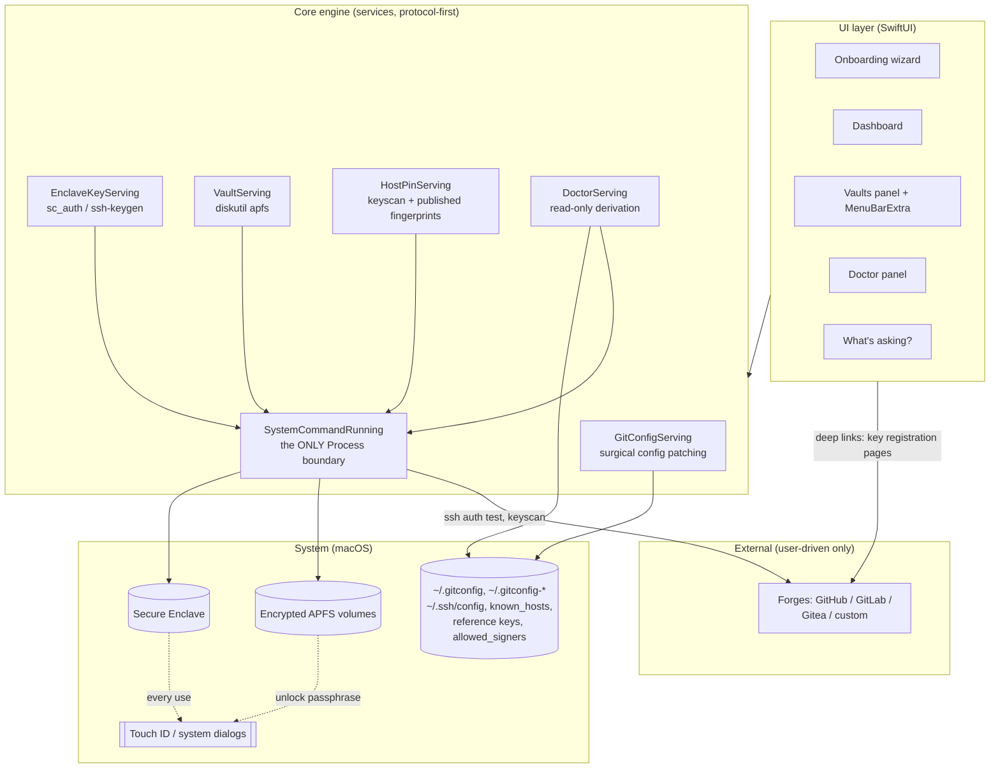
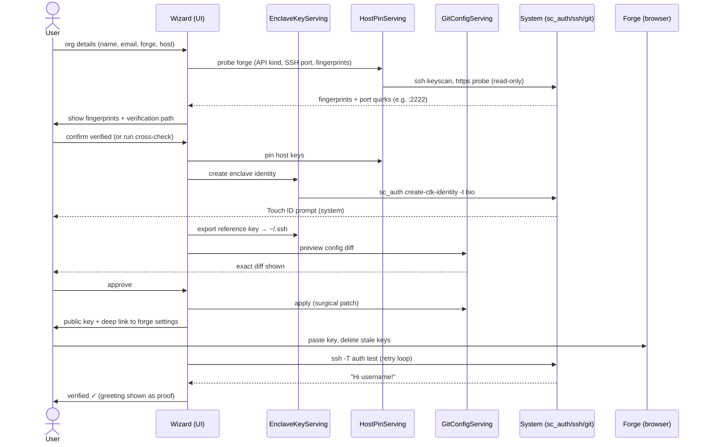
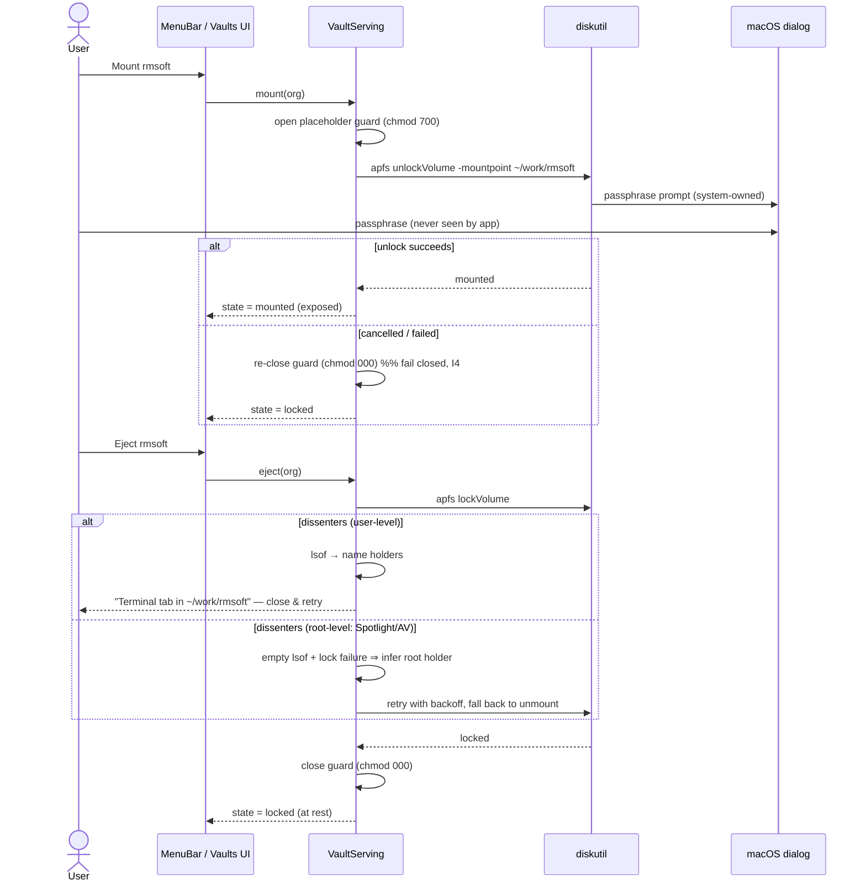
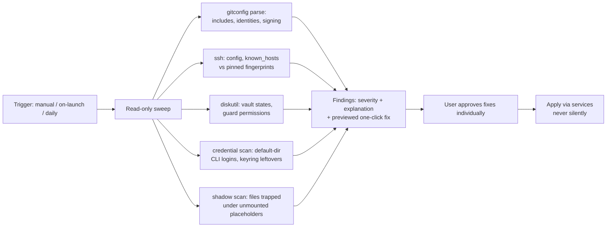

# Vaultkit — Data Flow & Architecture

## Layers

**Rules encoded in the layering:**

- The UI never touches the system; it calls services. Services never render UI.
- `SystemCommandRunning` is the single choke point for subprocess execution —
  auditable, mockable, and the natural place for the "preview every command" hook.
- Nothing in any layer stores secrets. The two dotted edges are where secrets
  exist — inside Apple's dialogs, invisible to the app (invariant I1).

## Sources of truth

| Data | Lives in | Vaultkit's copy |
|---|---|---|
| Git identity & routing | `~/.gitconfig` + `~/.gitconfig-<org>` | derived, disposable |
| SSH key handles | Secure Enclave + `~/.ssh/id_*` reference files | derived (labels only) |
| Host pins | `~/.ssh/known_hosts` | derived |
| Vault state | APFS container (`diskutil`) | derived, polled |
| Org registry (names, forge hosts, folder paths) | `~/Library/Application Support/Vaultkit/orgs.json` | **owned** — the only file Vaultkit owns, and it contains no secrets |

If `orgs.json` is deleted, the Doctor can reconstruct organizations by scanning
the gitconfig includes — the app degrades gracefully (invariant I2).

## Flow 1 — Add organization (UC1/UC2)

## Flow 2 — Vault lifecycle (UC4/UC5)

## Flow 3 — Doctor (UC6)

## Trust boundaries & privilege inventory

| Operation | Tool | Privilege | Secret exposure |
|---|---|---|---|
| Create/list/delete enclave identity | `sc_auth` | user | none — key born in enclave |
| Export reference key | `ssh-keygen -K` | user | none — handle file, useless without enclave+touch |
| Read/patch git & ssh config | direct file IO | user | none |
| Create encrypted volume | `diskutil apfs addVolume -passprompt` | user (Owners enabled) | passphrase in system prompt only |
| Mount/eject vault | `diskutil apfs unlock/lockVolume` | user | same |
| Auth verification | `ssh -T` | user | signature via enclave + touch |
| Host scan / forge probe | `ssh-keyscan`, HTTPS GET | user | none (public data) |
| Prompt attribution | `ps`, `lsof` | user (root holders inferred, not seen) | none |

### Passphrase entry paths (honest note on I1)

`diskutil` has no GUI prompt when driven by an app, so v0.x mounts use an app-rendered
`SecureField` piped to `diskutil apfs unlockVolume -stdinpassphrase`: the passphrase
transits app memory once, is never persisted or logged, and the buffer is released
immediately. This is a documented deviation from the "system dialogs only" ideal;
the roadmap is to move to a DiskArbitration-based unlock where macOS owns the dialog.
Volume *creation* stays fully I1-clean: the wizard hands that step to the user's
terminal (`-passprompt`), exactly like the manual flow.

**No component runs as root.** No privileged helper is installed. The app is
sandboxed-hostile territory (it must touch `~/.ssh` and run `diskutil`), so it
ships **unsandboxed but hardened-runtime, signed and notarized** — and open
source, because its audience will (rightly) read the code before trusting it.

## Failure modes the design must absorb

1. **Cancelled system prompts** at any step → fail closed, state machine returns to the last safe state (I4).
2. **Touch ID unavailable** (clamshell, external display) → detect via `AppleClamshellState` preflight, wait for change, resume.
3. **Root-level vault dissenters** (indexing, AV) → invisible to user-level `lsof`; infer from empty-holder + lock failure, retry with backoff.
4. **Hand-edited configs** → the parser must preserve unknown content byte-for-byte; if a file can't be parsed confidently, Vaultkit refuses to patch and explains, never guesses.
5. **Forge quirks** → SSH on non-standard ports (Gitea built-in server), GitLab's signing-key re-add restriction, GitHub SSO authorize buttons: encoded per-forge, verified by the live auth test rather than assumed.
6. **Deleted app state** → orgs.json is reconstructable from the system (I2).
7. **Backup software interaction** → Time Machine snapshots can hold a vault
   *unlocked after unmount* (plain mount then needs no passphrase — handle the
   `-69589 not locked` path), and an **included vault path copies plaintext to
   the backup destination** while mounted. Worse: **`lockVolume` reports
   success while a mounted snapshot still references the keys** — the volume
   silently stays unlocked, so every lock must be verified afterwards (evict
   snapshot mounts, relock, re-check) before claiming "at rest". The Doctor
   must check: vault paths excluded from backups, or the destination encrypted.
